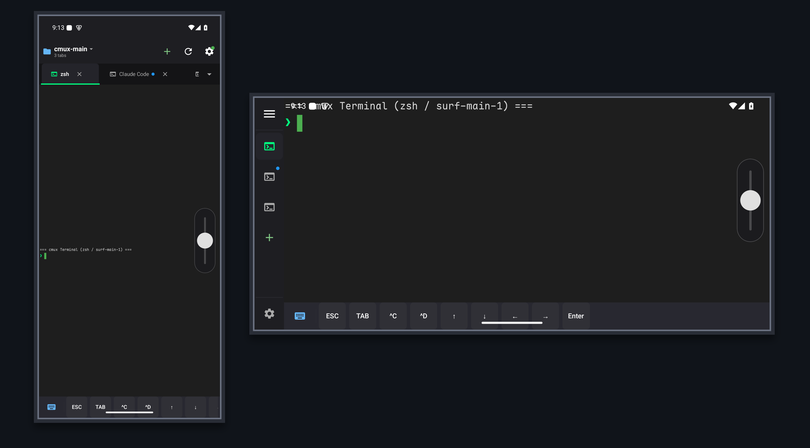
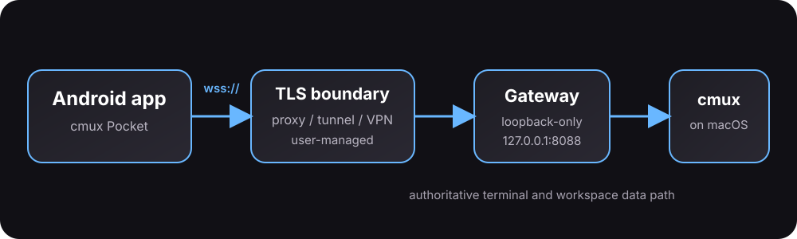
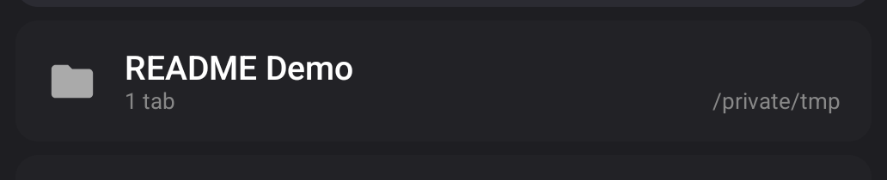
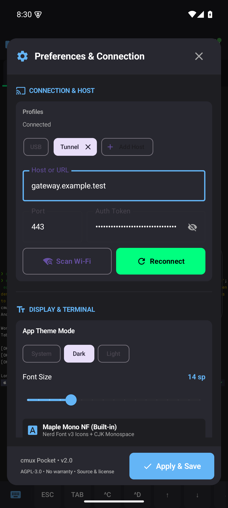

# cmux Pocket

cmux Pocket is an independent Android companion for people who use [cmux](https://cmux.com/) on macOS and want authoritative terminal workspaces and tabs on a phone.

> This is an independent community project. It is not affiliated with cmux and is not endorsed by the cmux project or its maintainers. “cmux” identifies the compatibility target only.

[Download the signed APK](https://github.com/shiquda/cmux-pocket/releases/latest) · [Networking and setup guide](docs/networking.md)



## What it does

- Renders the authoritative `cmux.render-grid.v1` terminal data; Android does not run a second local PTY or VT parser.
- Switches Workspaces and Tabs on the phone without changing the Mac's current focus.
- Synchronizes tab creation and deletion from the Mac; closing the active tab requires confirmation.
- Keeps main-screen scrollback local to the phone while alternate-screen/TUI scrolling remains owned by cmux on the Mac.
- Uses encrypted Android connection profiles and a random Gateway authentication token.
- Keeps an active Gateway session through Android backgrounding with an ongoing connection notification; Android may still stop it after a force-stop or system policy action.
- Provides a compact keyboard with modifiers, navigation keys, and F1–F12.

## How the connection works



The Gateway listens on `127.0.0.1` only. Normal remote or LAN use therefore needs a user-managed TLS reverse proxy, secure tunnel, VPN, or equivalent boundary. The Android app uses `wss://` for every non-loopback endpoint; cleartext `ws://` is limited to loopback/USB-reverse development paths.

## Try it

### Recommended: LAN or user-managed secure networking

1. Install cmux on macOS and confirm `cmux ping` succeeds.
2. Install the Gateway CLI and let it create the token, config, and login service:

   ```bash
   brew install shiquda/cmux-pocket/cmux-pocket
   cmux-pocket setup
   cmux-pocket status
   ```

   `cmux-pocket setup` is idempotent. It stores the token with user-only permissions and manages the macOS `launchd` service; it does not print the raw token.
3. Put a trusted TLS reverse proxy, tunnel, VPN, or other user-managed secure network in front of the loopback Gateway. Use public TLS port `443` unless your boundary explicitly exposes another port.
4. Install the APK from the latest release, open **Settings**, add a profile using your `wss://` endpoint, paste the token from the path reported by `cmux-pocket setup`, and tap **Apply & Save**.

The app should show the Workspaces and Tabs currently available in cmux. See the [networking and setup guide](docs/networking.md) for LAN, reverse-proxy, tunnel, VPN, token, CLI, and troubleshooting details.

### Temporary development/testing path: ADB reverse

ADB reverse is useful for emulator and local device verification, but it is not the recommended user deployment:

```bash
adb reverse tcp:8088 tcp:8088
```

Use the built-in **USB** profile (`127.0.0.1:8088`) and the Gateway token. Re-run the reverse command after reconnecting or rebooting the device. Keep this path out of production or shared-network setups.

## In the app



The workspace picker and terminal tab bar are phone-local navigation. Selecting a Workspace or Tab does not move cmux's Mac-side focus.



Connection profiles store the endpoint and token in encrypted Android preferences. Use a trusted TLS certificate and a strong random token; never put tokens, private domains, tunnel IDs, or personal paths in screenshots or bug reports.

## Development

Requirements: JDK 17, Android SDK 35, Rust stable, and `uv` only for the legacy Python Gateway reference tests.

```bash
cargo test --workspace --locked
cd android
./gradlew testDebugUnitTest assembleDebug
```

Rust CLI smoke:

```bash
cargo run -p cmux-pocket-cli -- --help
cargo run -p cmux-pocket-cli -- doctor --offline --json
```

Legacy Gateway reference tests:

```bash
cd gateway
uv run --with websockets python3 -m unittest test_gateway test_replay_normalize test_agent_completion_event

```

The repository's Android–Gateway protocol test uses a mock Gateway bound to loopback and fixed test credentials; those values are for tests only.

## Security and privacy

- The Gateway refuses non-loopback binds and does not expose a public listener by itself.
- Non-loopback Android connections require `wss://`; plaintext `ws://` is limited to `127.0.0.1` and `localhost`.
- Connection profiles and tokens use encrypted Android preferences; Android app-data backup is disabled.
- Do not commit or publish tokens, tunnel IDs, private addresses, workspace names, terminal contents, or personal identifiers.

Report security issues privately through GitHub's **Security → Report a vulnerability**. Do not post credentials, addresses, logs, or terminal contents in public Issues.

## License

Unless stated otherwise, the project code is released under the [GNU Affero General Public License v3.0](LICENSE).

The bundled Maple Mono NF font is licensed under the [SIL Open Font License 1.1](LICENSES/MapleMono-OFL-1.1.txt). See [THIRD_PARTY_NOTICES](THIRD_PARTY_NOTICES) for details.

> **Release signing notice:** `v0.1.0` uses the existing local Android debug keystore for update continuity. This is not a production or app-store signing identity; replace it with a dedicated release keystore before wider distribution.
