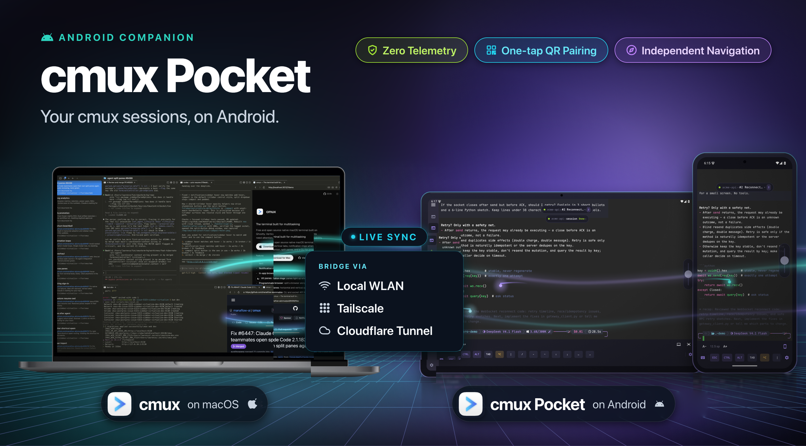
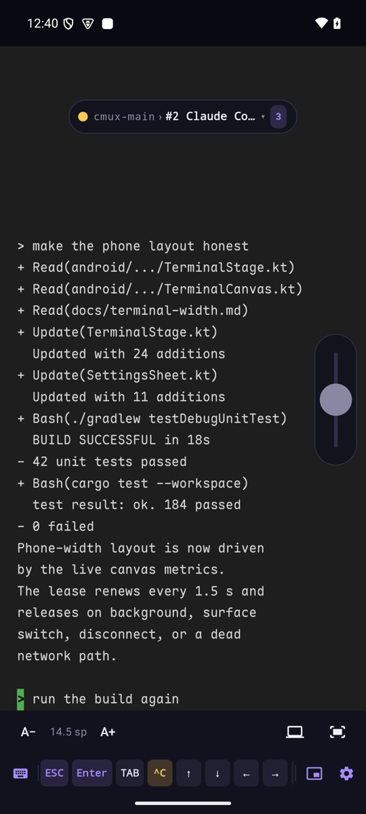
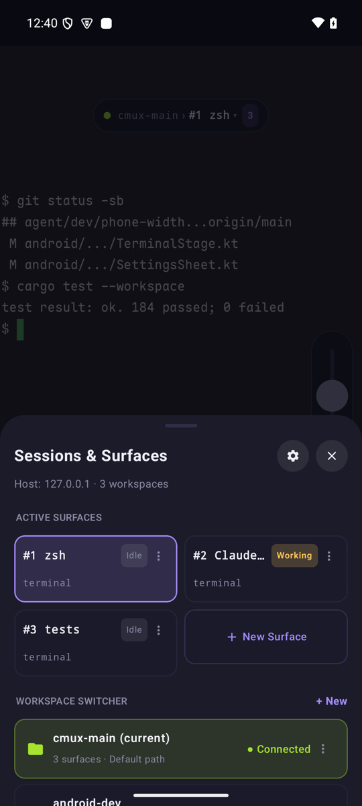
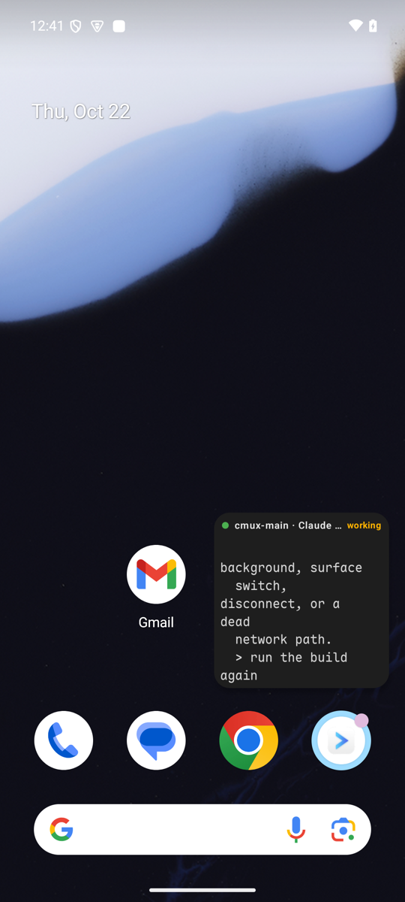
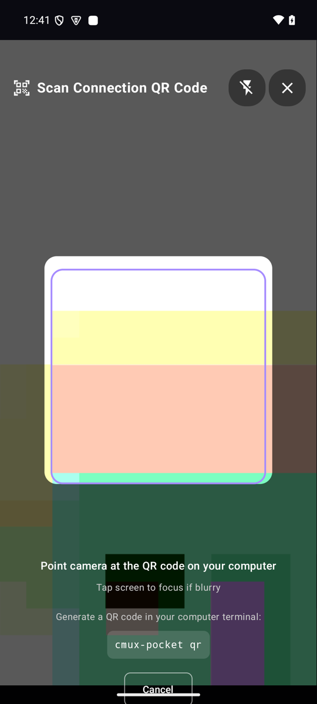
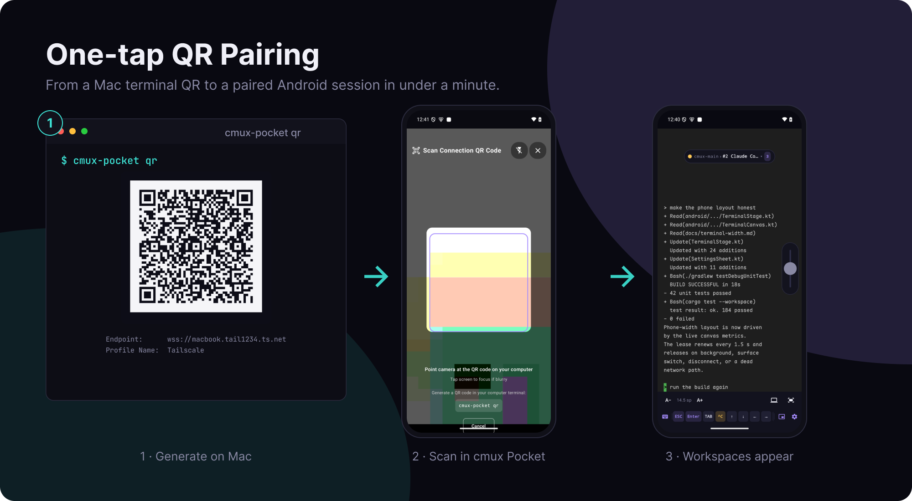

# cmux Pocket

cmux Pocket is an independent Android companion for [cmux](https://cmux.com/) on Mac, for developers who want remote access to their terminal workspaces and AI agent sessions from a phone.

[](https://github.com/shiquda/cmux-pocket/releases/latest)
[](https://github.com/shiquda/cmux-pocket/actions/workflows/release.yml)
[](LICENSE)
[](#quick-start)
[](#quick-start)
[](https://github.com/shiquda/homebrew-cmux-pocket)

> **Disclaimer:** Independent community project. Not affiliated with or endorsed by cmux. “cmux” identifies the compatibility target only.

[Download Signed APK](https://github.com/shiquda/cmux-pocket/releases/latest) · [Highlights](#highlights) · [Quick Start](#quick-start) · [Documentation](#documentation)



## Highlights

<table>
  <tr>
    <td align="center" valign="top" width="25%">
      <br><br>
      <strong>Phone-width Terminal</strong><br>
      <sub>Dynamic PTY reflow for AI agents &amp; TUIs</sub>
    </td>
    <td align="center" valign="top" width="25%">
      <br><br>
      <strong>Independent Drawer</strong><br>
      <sub>Switch surfaces without Mac focus conflict</sub>
    </td>
    <td align="center" valign="top" width="25%">
      <br><br>
      <strong>Floating Window</strong><br>
      <sub>Live PiP terminal stream over any app</sub>
    </td>
    <td align="center" valign="top" width="25%">
      <br><br>
      <strong>One-tap Pairing</strong><br>
      <sub>Instant QR import &amp; Keystore security</sub>
    </td>
  </tr>
</table>

## Quick Start

You need **Android 8.0+** and a **Mac with macOS 13+** running cmux. Keep the Mac awake while connected.

1. **Install Android:** download and install the latest signed APK from [GitHub Releases](https://github.com/shiquda/cmux-pocket/releases/latest).
2. **Start the Mac Gateway:**

   ```bash
   brew install shiquda/cmux-pocket/cmux-pocket
   cmux-pocket setup
   cmux-pocket status
   ```

3. **Connect the devices:** for the recommended Tailscale route, install Tailscale on both devices, connect them to the same tailnet, and enable MagicDNS and HTTPS certificates. With the `tailscale` CLI available on the Mac, run:

   ```bash
   cmux-pocket setup --tailscale
   cmux-pocket qr
   ```

   Select the Tailscale endpoint in the QR picker. For TLS setup and other networks, see the [networking guide](docs/networking.md#2-choose-a-secure-boundary).
4. **Pair:** open **Settings → Connection → Scan QR** on Android, scan the code, review the preview, and tap **Import & Connect**. Your cmux workspaces and tabs appear on the phone.



If workspace access fails, check [cmux socket permissions](docs/networking.md#cmux-socket-access): cmux's default process restriction can reject the background Gateway. Keep pairing QR codes private—they contain your access token.

## Documentation

- [App guide & screenshots](docs/app-guide.md): sessions, touch gestures, keyboard, floating window, settings, and APK verification.
- [Networking & troubleshooting](docs/networking.md): Tailscale, LAN/TLS proxies, Cloudflare Tunnel, QR pairing, Gateway upgrades, and connection diagnostics.
- [Terminal width](docs/terminal-width.md): phone-width layout and shared terminal resizing.
- [Architecture](docs/architecture.md) · [Design system](DESIGN.md)
- [Development & releases](docs/development.md) · [Changelog](CHANGELOG.md)

Report bugs through [GitHub Issues](https://github.com/shiquda/cmux-pocket/issues). Report vulnerabilities privately via [GitHub Security Advisories](https://github.com/shiquda/cmux-pocket/security/advisories/new); never include tokens, pairing codes, or private tunnel URLs in public reports.

## License

Code: [AGPL-3.0](LICENSE). Bundled Maple Mono NF: [SIL Open Font License 1.1](LICENSES/MapleMono-OFL-1.1.txt). See [third-party notices](THIRD_PARTY_NOTICES).
